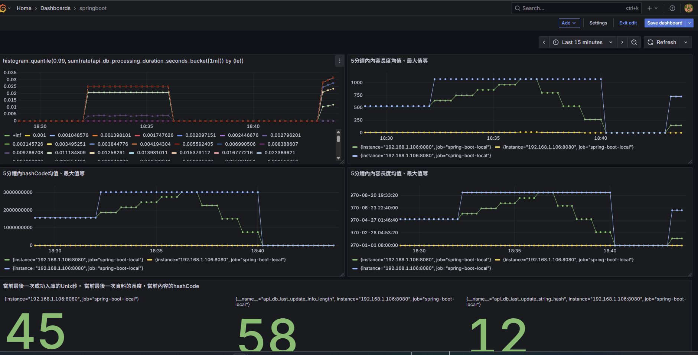

# Grafana Prometheus 指標顯示設定說明

| 目標指標                             | PromQL 查詢範例                                               | Grafana 單位設定            | 顯示內容說明                                        |
|------------------------------------|--------------------------------------------------------------|----------------------------|--------------------------------------------------|
| api_db_processing_duration_seconds (Timer) | `rate(api_db_processing_duration_seconds_sum[5m]) / rate(api_db_processing_duration_seconds_count[5m])` | 秒（s）                   | 近5分鐘平均 API 執行延遲                             |
| api_db_processing_duration_seconds_bucket (Timer histogram bucket) | `histogram_quantile(0.99, sum(rate(api_db_processing_duration_seconds_bucket[5m])) by (le))` | 秒（s）                   | 99% 延遲分位數                                    |
| api_db_success_total (Counter)     | `rate(api_db_success_total[5m])`                             | 無                         | 近5分鐘成功寫入數量速率                            |
| api_db_last_update_epoch_seconds (Gauge) | `api_db_last_update_epoch_seconds * 1000`                     | dateTimeAsMillis           | 顯示最後成功寫入時間的 ISO 格式（需乘以1000轉毫秒）   |
| 時間戳相對距現在                    | `time() * 1000 - api_db_last_update_epoch_seconds * 1000`     | 毫秒時間持續時間/秒          | 顯示距離最後更新多少秒前（轉 Duration 顯示）         |

---

## Grafana 設定要點
- PromQL 中 Unix timestamp 秒數需乘以 1000 變成毫秒。
- 面板「Field」或「Overrides」中，該欄位設定單位為 `dateTimeAsMillis`。
- 使用 Time series、Table 或 Stat 面板來顯示時間格式。
- 顯示距離現在時間可用 `time() * 1000 - metric * 1000`，設定單位為 Duration。

---

## 說明
- Timer 需啟用 `.publishPercentileHistogram()` 才會有完整 histogram bucket 數據，支持 `histogram_quantile()` 查詢。
- Prometheus 收到的 Gauge 本質是數值，Grafana 依單位顯示格式轉換為可讀時間。
- 若想更靈活展示時間，可用 PromQL 計算時間差，搭配 Grafana 持續時間格式。

---

這套配置確保你在 Grafana 中看到的是清晰的時間日期格式，而非 UNIX 秒數，方便做監控和告警。

# Micrometer + Prometheus + Grafana 指標完整說明

## 一、四大指標類型總覽

| 類型 | 用途 | 特性 | 常見應用舉例 | 主要輸出指標 |
|------|------|------|----------------|---------------|
| **Timer** | 記錄事件的耗時（含次數與分布） | 產生 `_count`, `_sum`, `_max`, `_bucket` | 計算 API 延遲、任務處理時間 | `_count`, `_sum`, `_max`, `_bucket{le=...}` |
| **Counter** | 累計次數，只會增加 | 只能遞增或重置 | 成功次數、錯誤總數 | `_total` |
| **Gauge** | 追蹤當前值，可上升可下降 | 非累積性，取即時值 | 記錄最新更新時間、佇列長度 | 主指標一個，例如 `_seconds` |
| **DistributionSummary** | 收集樣本分布（數量、總和、最大） | 類似 Histogram，無 bucket | 資料大小、Payload 長度分析 | `_count`, `_sum`, `_max` |

---

## 二、程式層使用與輸出指標對應

### 1. Timer — `api.db.processing.duration`

#### 程式：
```java
Timer.builder("api.db.processing.duration")
.description("API entry to DB insert")
.publishPercentileHistogram()
.minimumExpectedValue(Duration.ofMillis(1))
.maximumExpectedValue(Duration.ofSeconds(30))
.register(registry);
```


#### 輸出指標一覽

| 指標名稱 | 含義 |
|-----------|------|
| `api_db_processing_duration_seconds_count` | 已記錄的總次數 |
| `api_db_processing_duration_seconds_sum` | 累積總耗時（秒） |
| `api_db_processing_duration_seconds_max` | 最大單次耗時 |
| `api_db_processing_duration_seconds_bucket{le=...}` | 各分位 bucket 用於統計 P95/P99 |


#### Micrometer 屬性說明
| 屬性 | 說明 | 範例 |
|------|------|------|
| `.publishPercentileHistogram()` | 啟用統計 bucket 分布 | 允許 Prometheus 查百分位 |
| `.minimumExpectedValue(Duration.ofMillis(1))` | 忽略過短請求 | 低於 1ms 不納入計算 |
| `.maximumExpectedValue(Duration.ofSeconds(30))` | 忽略過長請求 | 超過 30s 歸最大桶 |

#### PromQL 操作範例
| 查詢 | 含義 | 範例輸出 |
|-------|------|---------|
| `rate(api_db_processing_duration_seconds_sum[5m]) / rate(api_db_processing_duration_seconds_count[5m])` | 過去 5 分鐘平均耗時 | 約 0.03 秒 |
| `histogram_quantile(0.99, sum(rate(api_db_processing_duration_seconds_bucket[5m])) by (le))` | 第 99 百分位延遲 | 約 0.10 秒（100ms） |

---
- **`publishPercentileHistogram()`**：啟用 Timer 的 histogram bucket，Micrometer 會把耗時分布記錄到不同時間段桶，例如 ≤1ms、≤10ms、≤100ms 等。

- **`minimumExpectedValue(Duration.ofMillis(1))`**：設定最小記錄的時間邊界，低於 1 毫秒的耗時不納入統計（提升效能且避免無意義數據）。

- **`maximumExpectedValue(Duration.ofSeconds(30))`**：設定最大時間邊界，超過 30 秒的耗時統一計算在最大桶中，避免桶數過多。

#### 說明

1. 假設一個 API 執行時間散布在 5ms ～ 20ms 間，透過此配置，Micrometer 就會將各次執行依時間段放入適當 bucket。
2. `rate(api_db_processing_duration_seconds_sum[5m]) / rate(api_db_processing_duration_seconds_count[5m])` 是什麼意思？
   - 這個 PromQL 查詢計算過去 5 分鐘內的平均耗時。`rate(..._sum[5m])` 計算在 5 分鐘內總耗時的增量速率，`rate(..._count[5m])` 計算在同一時間內請求次數的增量速率。兩者相除即得平均每次請求的耗時。
   - 5 分鐘內總耗時 6 秒，執行 200 次請求，則平均耗時為：
     \[
     6 \text{秒} \div 200 = 0.03 \text{秒} = 30 \text{毫秒}
     \]
   3. `histogram_quantile(0.99, sum(rate(api_db_processing_duration_seconds_bucket[5m])) by (le))` 是什麼意思？
      - 用途是計算 **最近 5 分鐘內請求時長的第 99 百分位（P99）延遲時間**。
      - `api_db_processing_duration_seconds_bucket` 是 histogram 各時間段的請求數累積。
      - `rate(...[5m])` 表示計算 5 分鐘平均每秒請求數（速率）。
      - `sum(... by (le))` 根據 bucket 上限 `le` 聚合。
      - `histogram_quantile(0.99, ...)` 根據桶分布估算 P99。
      - | 桶 (le)| 請求數量 | 佔比累積 |
        |--------|---------|--------|
        | 0.01s  | 50      | 50%    |
        | 0.05s  | 90      | 90%    |
        | 0.10s  | 99      | 99% ←  |
        | 0.20s  | 100     | 100%   |
        - P99 延遲顯示約為 0.1 秒（100 毫秒）。


### 2. Counter — `api.db.success.total`

#### 程式：
```java
Counter.builder("api.db.success.total")
.description("Total successful DB inserts")
.register(registry);
```


#### 輸出指標
| 指標名稱 | 含義 |
|-----------|------|
| `api_db_success_total` | 成功寫入次數（累計） |

#### Grafana 常用 PromQL
| 查詢 | 含義 |
|-------|------|
| `rate(api_db_success_total[5m])` | 每秒成功量的速率 |
| `api_db_success_total` | 總寫入次數 |

---

### 3. Gauge — 即時狀態監控

#### 範例：
```java
Gauge.builder("api.db.last_update_epoch_seconds", lastUpdateEpoch, AtomicReference::get)
.description("Last DB update timestamp")
.register(registry);
```


#### 輸出指標
| 指標名稱 | 含義 |
|-----------|------|
| `api_db_last_update_epoch_seconds` | 最後一次寫入的 Unix 時間（秒） |
| `api_db_last_update_info_length` | 最後資料長度 |
| `api_db_last_update_string_hash` | 最後內容的 hash |

#### Grafana 設定與顯示
| 設定 | 用途 | 範例結果 |
|------|------|-----------|
| PromQL：`api_db_last_update_epoch_seconds * 1000` | 轉毫秒可顯示時間 | `dateTimeAsMillis` 顯示 `2025-01-01 12:00:00` |
| PromQL：`time() - api_db_last_update_epoch_seconds` | 顯示距現在的秒數 | 300 （5 分鐘前更新） |

---

### 4. DistributionSummary — 數據分布統計

#### 程式：
```java
DistributionSummary.builder("api.db.last_update_info_length_summary")
.description("Summary of record lengths")
.register(registry);
```


#### 輸出指標
| 指標名稱 | 含義 |
|-----------|------|
| `_summary_count` | 样本次數 |
| `_summary_sum` | 累計總量 |
| `_summary_max` | 最大樣本值 |

#### PromQL 範例
| 查詢 | 意義 |
|-------|------|
| `avg_over_time(api_db_last_update_info_length_summary_sum[5m]) / avg_over_time(api_db_last_update_info_length_summary_count[5m])` | 近 5 分鐘平均資料長度 |
| `max_over_time(api_db_last_update_info_length_summary_max[5m])` | 近 5 分鐘最大記錄 |

---

## 三、PromQL 查詢指令速查表

| 功能 | 查詢語法 | 說明 |
|------|-----------|------|
| **平均耗時** | `rate(timer_sum[5m])/rate(timer_count[5m])` | 求近 5 分鐘平均延遲 |
| **分位耗時 (P99)** | `histogram_quantile(0.99, sum(rate(timer_bucket[5m])) by (le))` | 推算分位延遲 |
| **成功速率** | `rate(counter_total[5m])` | 每秒成功率 |
| **平均資料大小** | `avg_over_time(summary_sum[5m]) / avg_over_time(summary_count[5m])` | 求平均長度 |
| **距最後更新** | `time() - api_db_last_update_epoch_seconds` | 監控距上次更新時間 |

---

## 四、Micrometer、Prometheus、Grafana 指標對應關係

| Micrometer 類型 | Prometheus 指標 | Grafana 常用功能 |
|------------------|------------------|-------------------|
| **Timer** | `_count`, `_sum`, `_max`, `_bucket` | 平均延遲、P95/P99 指標 |
| **Counter** | `_total` | 累積或速率觀察 |
| **Gauge** | 單值型指標 | 即時狀態或時間觀察 |
| **DistributionSummary** | `_count`, `_sum`, `_max` | 分布分析與趨勢監控 |

---

## 五、監控整體應用舉例

| 監控項目 | 對應指標 | 查詢/應用說明 |
|-----------|-----------|---------------|
| API 平均延遲 | Timer `_sum`、`_count` | 用 `sum/count` 計算平均 |
| API P99 延遲 | Timer `_bucket` | 用 `histogram_quantile()` 推算分位數 |
| 成功操作次數 | Counter `_total` | 累積與速率統計 |
| 最後更新時間 | Gauge `_epoch_seconds` | 用 `*1000` 顯示時間或用差值顯示距上次更新 |
| 資料長度統計 | DistributionSummary `_sum/_count` | 分析平均與最大長度變化 |

---

## 六、Micrometer 到觀測系統的完整鏈路

1. **應用層埋點**：Spring Boot + Micrometer 收集指標。
2. **Prometheus**：透過 `/actuator/prometheus` 抓取各 metrics。
3. **Grafana**：用 PromQL 分析數值、延遲分布與時間格式顯示。
4. **最終效果**：
    - 即時顯示 API 延遲 (均值+P99)
    - 顯示最後更新時間（自動解析時間格式）
    - 統計資料變化趨勢
    - 成功率與異常警示一目了然。

---
