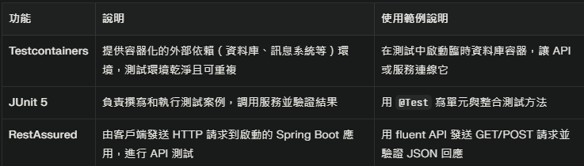

# Spring Boot 整合測試：Testcontainers、JUnit 5、RestAssured

以下為三大主軸常用的註解（@Annotation）與主要方法，條列簡潔說明整合測試的完整脈絡。

---

## 一、Testcontainers（容器化資料庫管理）

| 註解/方法                | 功能簡述                                      |
|----------------------|---------------------------------------------|
| `@Testcontainers`      | 啟用 Testcontainers 擴充，管理容器生命週期。                   |
| `@Container`           | 標記容器欄位，啟動並管理該資料庫容器。                      |
| `@ServiceConnection`   | Spring Boot 3.1+，自動注入容器連線資訊到 Spring Datasource。  |
| `@DynamicPropertySource` | 傳統方式注入容器動態參數到 Spring 設定（舊版使用）。              |
| `new PostgreSQLContainer<>("image")` | 建立資料庫容器實例（Postgres資料庫映像檔）                 |
| `.start() / .stop()`   | 手動啟動停止容器（通常不用，JUnit 5 自動管理容器）             |

---

## 二、JUnit 5（測試生命週期和斷言）

| 註解/方法                      | 功能簡述                                      |
|----------------------------|---------------------------------------------|
| `@SpringBootTest(webEnvironment = RANDOM_PORT)` | 啟動完整 Spring Boot 應用和隨機 Web 埠，用於整合測試。           |
| `@Test`                     | 標記測試方法。                                |
| `@BeforeEach`               | 每個測試方法執行前初始化。                         |
| `@BeforeAll`                | 全部測試前執行一次。                             |
| `@ActiveProfiles("test")`    | 指定啟用的 Spring Profile（切換 test 設定）。        |
| `Assertions.assertThat()`    | 斷言回傳結果或狀態。                             |
| `@TestConfiguration`        | 測試專用的 Spring 配置類。                         |

---

## 三、RestAssured（API 請求與回應驗證）

| 方法                                   | 功能簡述                                   |
|--------------------------------------|------------------------------------------|
| `given()`                            | 設定 HTTP 請求的條件（參數、header、body）。           |
| `when()`                             | 發送 HTTP 請求（GET、POST、DELETE等）。             |
| `then()`                             | 驗證 HTTP 回應狀態、內容、格式。                      |
| `.statusCode(int)`                   | 斷言回應狀態碼是否符合預期（如 200、201、404等）。     |
| `.body(String, Matcher)`             | 使用 Hamcrest Matchers 檢查 JSON 回應 內容。         |
| `.queryParam(String, Object)`        | 設定 URL 查詢參數，便於測試帶參數的 API。             |

---

---

## 熱門進階知識點

- `@RestartScope`：配合 DevTools 熱重載時保留容器 Bean，避免重啟時重建容器。
- Profile 切換：搭配 `@ActiveProfiles("test")` 和 `application-test.properties` 管理環境資料庫設定。
- `@DynamicPropertySource`：在 DevTools 3.1 以下版本注入容器參數。

---

## 總結

| 主軸                | 作用描述                                                |
|-------------------|-------------------------------------------------------|
| Testcontainers     | 整合 Docker 容器測試資料庫，保證環境隔離、重複測試穩定性。                     |
| JUnit 5            | 實現測試生命週期管理及斷言，確保測試邏輯正確。                                   |
| RestAssured        | 透過 HTTP 呼叫模擬真實 API，驗證控制器回應與業務邏輯。                          |

---

此為 Spring Boot 現代化整合測試三大技術的 @annotation 與主要方法脈絡簡述，可作為完整測試架構設計的參考。

- https://springdoc.cn/spring-boot-built-in-testcontainers/
# Spring Boot Testcontainers 常用註解（Annotation）簡明整理

## @Testcontainers
- **作用**：啟用 Testcontainers JUnit 擴充功能，讓此測試類別能由 Testcontainers 管理容器生命週期。​
- **用法**：加在測試類別上方。
- **說明**：會自動啟動擁有 `@Container` 標註的容器。

## @Container
- **作用**：標記該欄位為 Testcontainers 的容器，讓其由框架管理。​
- **用法**：加在容器宣告的變數上（多數建議為 static 欄位）。
- **說明**：static 欄位會在所有測試開始前啟動一次；非 static 欄位則每個測試都會重新啟動容器。

## @ServiceConnection（Spring Boot 3.1+）
- **作用**：自動將容器連線資訊（如資料庫位址、帳密）註冊到 Spring Boot 測試環境。​
- **用法**：加在 `@Container` 容器變數上。
- **說明**：省去手動註冊連線參數的繁瑣，Spring Boot 會依容器型態自動配對設定。

## @DynamicPropertySource（搭配 Testcontainers 舊版 Spring Boot 使用）
- **作用**：動態註冊容器產生的配置（如 JDBC 連線字串）給 Spring 測試上下文。​
- **用法**：宣告一個 static 方法，透過 `DynamicPropertyRegistry` 物件添加連線資訊。
- **說明**：`@ServiceConnection` 現已可自動處理這件事，舊專案仍可使用此寫法。

## 範例

@Testcontainers
@SpringBootTest
class MyIntegrationTests {
@Container
@ServiceConnection
static MySQLContainer<?> mysql = new MySQLContainer<>("mysql:8.0");
// Spring Boot 3.1 以上，會自動註冊 mysql 容器的連線資訊
}

text

僅需依測試需求套用對應註解，Testcontainers 就能與 Spring Boot 無縫整合，讓外部依賴環境測試自動化

# Spring Boot 整合測試方案說明

## Testcontainers
使用 `@Testcontainers` 註解整合 Testcontainers。  
透過 `@Container` 啟動 PostgreSQL 容器，提供真實且隔離的資料庫環境。  
在測試過程中，資料庫由測試框架動態建立與管理，測試結束後自動銷毀。

## JUnit 5
使用 JUnit 5 的 `@Test` 與 `@BeforeEach` 註解管理測試生命週期。  
建立多個測試方法分別驗證不同 API 功能，結構清晰，符合單元測試與整合測試慣例。

## RestAssured
利用 RestAssured 發送 HTTP 請求至啟動的 Spring Boot 應用，模擬用戶端操作行為。  
使用 Fluent API 驗證回應狀態碼與返回的 JSON 內容，並搭配 `queryParam` 參數測試動態排序的 API 行為。

## 總結
此測試方案涵蓋以下重點：
- 提供真實資料庫環境測試（非模擬環境，具高度可靠性）
- 明確且自動化的 HTTP API 行為驗證（端對端測試風格）
- 完整且嚴謹的測試生命週期管理與初始化

根據程式碼，可確認 Testcontainers、JUnit 5 與 RestAssured 已被充分且正確使用：
- Testcontainers：透過 `@Testcontainers` 與 `@Container` 啟動並管理 PostgreSQL 容器，保證資料庫環境隔離且真實。
- JUnit 5：使用 `@Test` 與 `@BeforeEach` 管理測試方法與初始化，遵循 JUnit 5 測試框架流程。
- RestAssured：使用流暢的 DSL 發送 HTTP 請求並驗證 API 回應，涵蓋 RESTful 操作與參數驗證。

# 為什麼不用使用 @DynamicPropertySource

Testcontainers 啟動的容器會動態分配埠號和連線參數（如 JDBC URL、帳號、密碼等），這些資訊無法事先寫死在 `application.properties`。  
`@DynamicPropertySource` 用於在程式啟動時動態將這些連線資訊注入到 Spring 的配置中，使 Spring Data / JPA 能自動使用正確的資料庫連線。

此註解替代了手動在配置檔案中硬編寫連線參數或透過環境變數設定的方式，提高使用便利性與可靠性。

在 Spring Boot 3.1 以上版本，建議直接使用 `@ServiceConnection` 註解容器變數，Spring Boot 會自動傳遞並注入連線參數，無需再撰寫 `@DynamicPropertySource` 方法。
